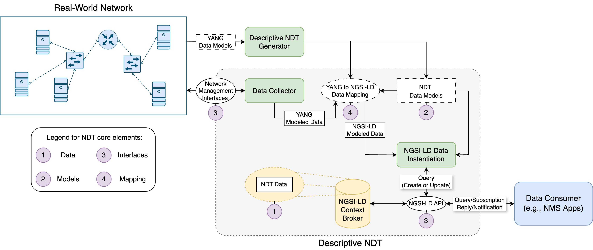
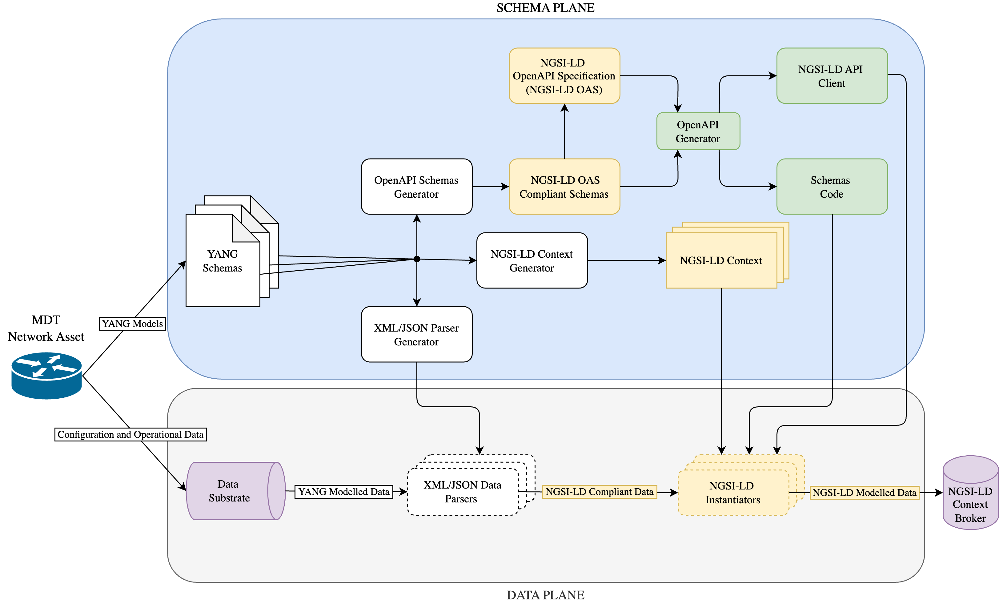

# YANG to NGSI-LD for Descriptive NDT
Repository with source code, artifacts and documentation about YANG [[1](https://datatracker.ietf.org/doc/html/rfc7950)] to NGSI-LD translation. This translation process is the baseline for modeling a *Descriptive Network Digital Twin (Descriptive NDT)* solution by means of the NGSI-LD standard specified by ETSI ISG CIM [[2](https://www.etsi.org/deliver/etsi_gs/CIM/001_099/009/01.08.01_60/gs_CIM009v010801p.pdf)].

## Descriptive NDT architecture
The proposed *Descriptive NDT* architecture covers the core elements of NDT described by an IETF draft [[3](https://datatracker.ietf.org/doc/html/draft-irtf-nmrg-network-digital-twin-arch-05)] and the *descriptive twin* vision provided by ETSI ISG CIM and its NGSI-LD standard specification [[4](https://www.etsi.org/deliver/etsi_gr/CIM/001_099/017/01.01.01_60/gr_CIM017v010101p.pdf)]. The architecture proposes an automated methodology for mapping data from network management domain to an NDT representation, following a data materialization approach supported by the NGSI-LD standard. The solution is targeted to real networks supporting Model-Driven Telemetry (MDT) and management mechanisms based on YANG data modeling language [[5](https://www.oreilly.com/library/view/network-programmability-with/9780135180471/)]. 


### Descriptive NDT prototype implementation:
The implementation of this *Descriptive NDT* architecture is mainly based on the use of the OpenAPI Specification (OAS) compatible with the NGSI-LD API [[6](https://forge.etsi.org/rep/cim/ngsi-ld-openapi/-/tree/1.6.1)]. The OAS allows modeling the NDT data schemas (i.e., *NDT Data Models* in the Descriptive NDT architecture), as well as generating a client library with programmable code that makes use of the NGSI-LD API and the generated schemas for instantiating the resulting NDT data. The client is implemented in Python, a programming language that also provides additional libraries (e.g., *pyang* [[7](https://github.com/mbj4668/pyang)] or *pydantic* [[8](https://docs.pydantic.dev/latest/)]) for parsing the YANG modeled data and completing the mapping process to NGSI-LD modeled data, as well as for instantiating the NDT data. 



The prototype separates its functionality into two main planes: *Descriptive NDT Generator Plane* and *Data Pipeline Plane*. The *Descriptive NDT Generator Plane* general functionality consists in processing the native data models of the MDT Network Assets (i.e., *YANG Schemas*) in order to generate different programmed artifacts that allow performing the YANG to NGSI-LD translation in an autonomous way. Then, the *Data Pipeline Plane* makes use of the programmed artifacts to be able to parse the raw configuration and operational data coming from network assets and generate NGSI-LD modeled data to be instantiated within a compliant NGSI-LD Context Broker. The network configuration and telemetry data is collected by using MDT network management protocol such as NETCONF or gNMI. For a NETCONF client working as a data collector, a Python library called *ncclient* [[9](https://github.com/ncclient/ncclient)] has been selected that supports all operations and capabilities defined by the NETCONF management protocol. Meanwhile, for gNMIc a CLI client called *gnmic* [[10](https://github.com/openconfig/gnmic)] has been selected that provides full support for Capabilities, Get, Set and Subscribe RPCs with collector capabilities and is also the gNMI client reference implementation provided by the OpenConfig consortium.


### Developed _pyang_ plugins:
- [candil-ngsi-ld-context-generator.py](yang/pyang-plugins/candil-ngsi-ld-context-generator.py): given one or several YANG modules, it generates the corresponding NGSI-LD context files in ```.jsonld``` format.
- [candil-xml-parser-generator.py](yang/pyang-plugins/candil-xml-parser-generator.py): given one or several YANG modules, it generates the Python code of an XML parser that reads data modeled by these modules and generates the corresponding NGSI-LD Entity data structures (dictionary buffers). XML Parser Generator for operational status and configuration information received from NETCONF Query RPCs, and also for telemetry notifications received from NETCONF YANG-Push Subscriptions.
- [candil-yang-identities-generator.py](yang/pyang-plugins/candil-yang-identities-generator.py): given one or several YANG modules, it generates the corresponding NGSI-LD Entity data structures (dictionary buffers) for YANG identities.
- [candil-json-parser-generator-queries.py](yang/pyang-plugins/candil-json-parser-generator-queries.py): given one or several YANG modules, it generates the Python code of an JSON parser that reads data modeled by these modules and generates the corresponding NGSI-LD Entity data structures (dictionary buffers). JSON Parser Generator for operational status and configuration information received from gNMI Query RPCs.
- [candil-json-parser-generator-notifications.py](yang/pyang-plugins/candil-json-parser-generator-notifications.py): given one or several YANG modules, it generates the Python code of an JSON parser that reads data modeled by these modules and generates the corresponding NGSI-LD Entity data structures (dictionary buffers). JSON Parser Generator for telemetry notifications received from gNMI Subscription RPCs.
- [candil-openapi-schemas-generator.py](yang/pyang-plugins/candil-openapi-schemas-generator.py): given one or several YANG modules, it dynamically generates the relative OpenAPI Schemas according to the OpenAPI specification for NGSI-LD API V1.6.1.
- [candil-json-parser-generator.py](yang/pyang-plugins/candil-json-parser-generator.py): given one or several YANG modules, it generates the Python code of an JSON parser that reads data modeled by these modules and generates the corresponding NGSI-LD Entity data structures (dictionary buffers). JSON Parser Generator for non-gNMI data modeled according to YANG modules. This means it is valid for data in JSON format that does not come from the gNMI protocol but is supported by IETF YANG models, OpenConfig YANG models, or vendor proprietary YANG models. ```Supported extra data sources: NetFlow v9 and Network Topologies.```

### Developed _yangtools_ artifacts:
- [TopologyDriver.java](yang/yang-tools-artifacts/topology-discoverer/topology-driver/src/main/java/upm/dit/giros/TopologyDriver.java): Java application based on the *YANG Tools* [[11](https://github.com/opendaylight/yangtools)], library for parsing data from network topology descriptor based on the ContainerLab [[12](https://containerlab.dev/)] simulation testbed and mapping it to YANG-compliant data according to the ietf-network and ietf-network-topology YANG data models ([RFC 8345](https://datatracker.ietf.org/doc/html/rfc8345)).
  
## Documentation and links
1. M. Björklund, “The YANG 1.1 Data Modeling Language,” *RFC 7950*, Internet Engineering Task Force, Aug. 2016.
2. ETSI, “Context Information Management (CIM); NGSI-LD API,” *GS CIM 009 V1.8.1*, ETSI, Mar. 2024.
3. ETSI, “Context Information Management (CIM); Feasibility of NGSI-LD for Digital Twins,” *GR CIM 017 v1.1.1*, ETSI, Dec. 2022.
4. C. Zhou et al., “Network Digital Twin: Concepts and Reference Architecture,” *Internet-Draft draft-irtf-nmrg-network-digital-twin-arch-05*, Internet Engineering Task Force, Mar. 2024. Work in Progress.
5. B. Claise, J. Clarke, and J. Lindblad, *Network Programmability with YANG: The Structure of Network Automation with YANG, NETCONF, RESTCONF, and gNMI*. Addison-Wesley Professional, 2019, isbn:9780135180617
6. OpenAPI specification for the NGSI-LD API specified by ETSI ISG CIM 009: https://forge.etsi.org/rep/cim/ngsi-ld-openapi/-/tree/1.6.1
7. pyang: https://github.com/mbj4668/pyang
8. pydantic: https://docs.pydantic.dev/latest/
9. ncclient: https://github.com/ncclient/ncclient
10. gNMIc: https://github.com/openconfig/gnmic
11. YANG Tools: https://github.com/opendaylight/yangtools
12. ContainerLab: https://containerlab.dev/
13. pyangbind: https://github.com/robshakir/pyangbind
14. poetry: https://python-poetry.org
