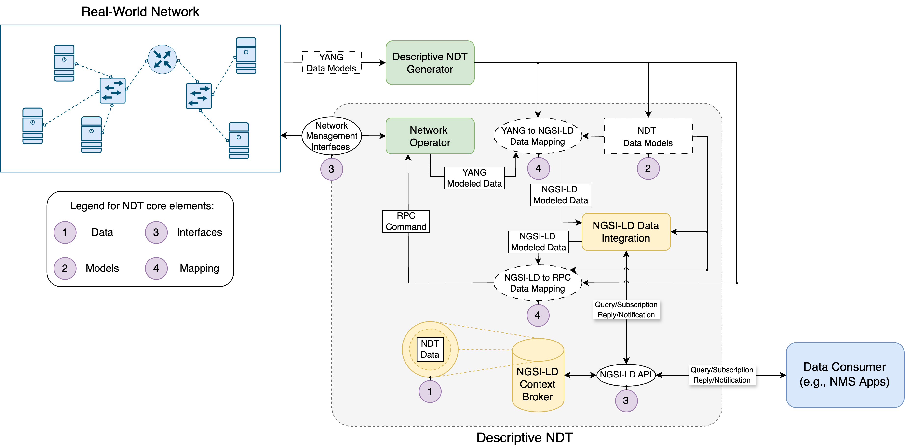
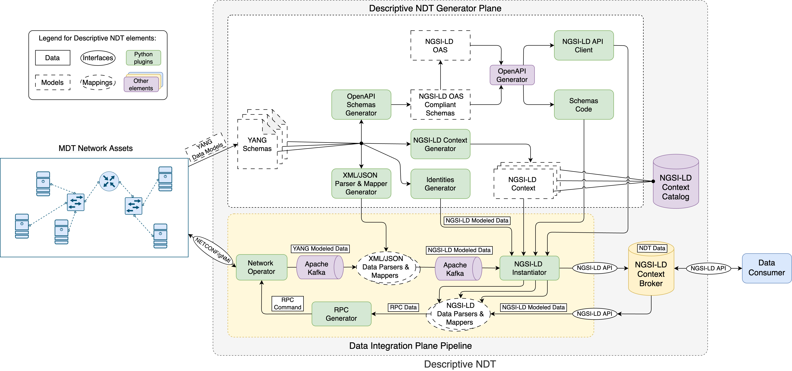

# YANG to NGSI-LD for Descriptive NDT
Repository with source code, artifacts and documentation about YANG [[1](https://datatracker.ietf.org/doc/html/rfc7950)] to NGSI-LD translation. This translation process is the baseline for modeling a *Descriptive Network Digital Twin (Descriptive NDT)* solution by means of the NGSI-LD standard specified by ETSI ISG CIM [[2](https://www.etsi.org/deliver/etsi_gs/CIM/001_099/009/01.08.01_60/gs_CIM009v010801p.pdf)].

# Table of Contents
- [YANG to NGSI-LD for Descriptive NDT](#yang-to-ngsi-ld-for-descriptive-ndt)
- [Table of Contents](#table-of-contents)
  - [Descriptive NDT architecture](#descriptive-ndt-architecture)
  - [Descriptive NDT prototype implementation](#descriptive-ndt-prototype-implementation)
    - [Developed _pyang_ plugins](#developed-pyang-plugins)
    - [Developed _yangtools_ artifacts](#developed-yangtools-artifacts)
  - [Performance experiments](#performance-experiments)
  - [Postman Collections](#postman-collections)
  - [Publications](#publications)
  - [Documentation and links](#documentation-and-links)
  - [License](#license)
  
## Descriptive NDT architecture
The proposed *Descriptive NDT* architecture covers the core elements of NDT described by an IETF draft [[3](https://datatracker.ietf.org/doc/html/draft-irtf-nmrg-network-digital-twin-arch-10)] and the *descriptive twin* vision provided by ETSI ISG CIM and its NGSI-LD standard specification [[4](https://www.etsi.org/deliver/etsi_gr/CIM/001_099/017/01.01.01_60/gr_CIM017v010101p.pdf)]. The solution is targeted to real networks supporting Model-Driven Telemetry (MDT) and management mechanisms based on YANG data modeling language [[5](https://www.oreilly.com/library/view/network-programmability-with/9780135180471/)]. The architecture proposes an automated methodology for mapping YANG data from network management domain to an NDT representation, following a data integration approach supported by the NGSI-LD standard. The solution proposes the use of generic rules, based on [[6](https://www.etsi.org/deliver/etsi_gr/CIM/001_099/038/01.01.01_60/gr_CIM038v010101p.pdf)], for translating between YANG and the NGSI-LD meta-model. 



## Descriptive NDT prototype implementation
There is a prototype implementation for completing the *Descriptive NDT* architecture which is built on a Docker microservices-based solution. This implementation has been validated for network automation purposes, covering network operations and management processes. The prototype implements actuation mechanisms based on the NGSI-LD API to obtain configuration and state data from real networks, apply configuration changes, and request telemetry data on demand, thus facilitating network automation. The validated prototype adopts a hybrid data integration approach based on both data materialization and data virtualization. 



The prototype separates its functionality into two main planes: *Descriptive NDT Generator Plane* and *Data Integration Plane Pipeline*. The *Descriptive NDT Generator Plane* general functionality consists in processing the native data models of the MDT Network Assets (i.e., *YANG Schemas*) in order to generate different programmed artifacts that enables performing the YANG to NGSI-LD and NGSI-LD to RPC (Remote Procedure Call) translations in an autonomous way. The *Data Integration Plane Pipeline* then uses the resulting artifacts to parse the NGSI-LD API operations and generate RPC commands to perform actions on network assets, but also to retrieve and parse the resulting network monitoring data coming and generate NGSI-LD modeled data to be instantiated within a compliant NGSI-LD Context Broker as NDT data. The network operations and management is performed by using model-driven network management protocol such as NETCONF or gNMI. For a NETCONF client working, a Python library called *ncclient* [[10](https://github.com/ncclient/ncclient)] has been selected that supports all operations and capabilities defined by the NETCONF management protocol. Meanwhile, for gNMI a CLI client called *gNMIc* [[11](https://github.com/openconfig/gnmic)] has been selected that provides full support for Capabilities, Get, Set and Subscribe RPCs with collector capabilities and is also the gNMI client reference implementation provided by the OpenConfig consortium.

The NGSI-LD Context Broker is the source and target of the *Data Integration Plane Pipeline* that handles requests and associated responses formulated to the Descriptive NDT via the NGSI-LD API by external data consumers. Then, a data consumer can request different operations using the NGSI-LD API for: 1) querying operational state and configuration data from MDT network assets; 2) configuring MDT network assets; and 3) subscribing to telemetry data coming from MDT network assets. The focus here is on how the NGSI-LD API operations are translated to the corresponding model-driven network management protocol operations. The Descriptive NDT solution address this translation process by converting the NGSI-LD API operation data to corresponding RPC data to fulfill network operations and management tasks.

The implementation of this *Descriptive NDT* prototype is mainly based on the use of the OpenAPI Specification (OAS) compatible with the NGSI-LD API [[7](https://www.etsi.org/deliver/etsi_gs/CIM/001_099/047/01.01.02_60/gs_CIM047v010102p.pdf)]. The OAS allows modeling the NDT data schemas (i.e., *NDT Data Models* in the Descriptive NDT architecture), as well as generating a client library with programmable code that makes use of the NGSI-LD API and the generated schemas for instantiating the resulting NDT data. The client is implemented in Python, a programming language that also provides additional libraries (e.g., *pyang* [[8](https://github.com/mbj4668/pyang)] or *pydantic* [[9](https://docs.pydantic.dev/latest/)]) for parsing the YANG modeled data and completing the mapping process to NGSI-LD modeled data, as well as for instantiating the NDT data. 

>*Note: MORE DETAILED AND TECHNICAL DOCUMENTATION COMING SOON!*

### Developed _pyang_ plugins
- [candil-ngsi-ld-context-generator.py](yang/pyang-plugins/candil-ngsi-ld-context-generator.py): given one or several YANG schemas, it generates the corresponding NGSI-LD context files in ```.jsonld``` format.
- [candil-xml-parser-generator.py](yang/pyang-plugins/candil-xml-parser-generator.py): given one or several YANG schemas, it generates the Python code of an XML parser that reads data modeled by these schemas and generates the corresponding NGSI-LD Entity data structures (dictionary buffers). XML Parser Generator for operational status and configuration information received from NETCONF Query RPCs, and also for telemetry notifications received from NETCONF YANG-Push Subscriptions.
- [candil-yang-identities-generator.py](yang/pyang-plugins/candil-yang-identities-generator.py): given one or several YANG schemas, it generates the corresponding NGSI-LD Entity data structures (dictionary buffers) for YANG identities.
- [candil-json-parser-generator-queries.py](yang/pyang-plugins/candil-json-parser-generator-queries.py): given one or several YANG schemas, it generates the Python code of an JSON parser that reads data modeled by these schemas and generates the corresponding NGSI-LD Entity data structures (dictionary buffers). JSON Parser Generator for operational status and configuration information received from gNMI Query RPCs.
- [candil-json-parser-generator-notifications.py](yang/pyang-plugins/candil-json-parser-generator-notifications.py): given one or several YANG schemas, it generates the Python code of an JSON parser that reads data modeled by these schemas and generates the corresponding NGSI-LD Entity data structures (dictionary buffers). JSON Parser Generator for telemetry notifications received from gNMI Subscription RPCs.
- [candil-openapi-schemas-generator.py](yang/pyang-plugins/candil-openapi-schemas-generator.py): given one or several YANG schemas, it dynamically generates the relative OpenAPI Schemas according to the OpenAPI specification for NGSI-LD API.
- [candil-json-parser-generator.py](yang/pyang-plugins/candil-json-parser-generator.py): given one or several YANG schemas, it generates the Python code of an JSON parser that reads data modeled by these schemas and generates the corresponding NGSI-LD Entity data structures (dictionary buffers). JSON Parser Generator for non-gNMI data modeled according to YANG schemas. This means it is valid for data in JSON format that does not come from the gNMI protocol but is supported by IETF YANG models, OpenConfig YANG models, or vendor proprietary YANG models. ```Supported extra data sources: NetFlow v9 and Network Topologies.```

### Developed _yangtools_ artifacts
- [TopologyDriver.java](yang/yang-tools-artifacts/topology-discoverer/topology-driver/src/main/java/upm/dit/giros/TopologyDriver.java): Java application based on the *YANG Tools* [[12](https://github.com/opendaylight/yangtools)], library for parsing data from network topology descriptor based on the Containerlab [[13](https://containerlab.dev/)] simulation testbed and mapping it to YANG-compliant data according to the ietf-network and ietf-network-topology YANG data models ([RFC 8345](https://datatracker.ietf.org/doc/html/rfc8345)).
  
## Performance experiments

The repository includes [experimental results](testbeds/performance-experiments) about the performance of the Descriptive NDT prototype solution:

- There are initial experimental results for determining the performance of the YANG to NGSI-LD translation and data intantiation processes in terms of latency (i.e., experiments in [1](testbeds/performance-experiments/experiment1) and [2](testbeds/performance-experiments/experiment2)) and throughput (i.e., experiment in [3](testbeds/performance-experiments/experiment3)). These experiments have been performed for telemetry statistics from network interfaces encoded in both XML and JSON formats according to notifications received by the NETCONF and gNMI management protocols. There are also preliminary performance results about the YANG to NGSI-LD translation and data intantiation processes for covering network monitoring data according to NetFlow v9 protocol (i.e., experiments in [4](testbeds/performance-experiments/experiment4)). These experimental results were performed following a data materialization approach.
  
- There are also additional experiments comparing the latency perfomance for completing network operations and management tasks by using both a data materialization approach and a data virtualization approach (i.e., experiments in [5](testbeds/performance-experiments/experiment5)). The experiments were carried out using the NETCONF and gNMI network management protocols and the NetFlow monitoring protocol.

## Postman Collections
This repository contains Postman collections that you can use to play with the REST APIs of some of the components present in the prototype for completing the Descriptive NDT architecture for network automation purposes. We recommend downloading [Postman Desktop](https://www.postman.com/downloads/) for an better user experience.

- [NDT Network Controller API using NGSI-LD standard](resources/postman_collections/NDT_Network_Controller_API_using_NGSI-LD_standard.postman_collection.json) Postman collection has a set of requests that can be used to cover network actuation mechanisms by applying both data materialization and data virtualization approaches. The REST API requests are based on the NGSI-LD standard.

## Publications
If you want more information about the original idea of the *Descriptive NDT* solution and its initial design, you can check our latest publication in the *IEEE Open Journal of the Communications Society*:

*D. González-Sánchez, L. Bellido, I. D. Martinez-Casanueva, D. Martínez-García, D. Fernández and D. R. Lopez, "Toward Building a Digital Twin for Network Operations and Management," in IEEE Open Journal of the Communications Society, vol. 6, pp. 2583-2598, 2025, doi: [10.1109/OJCOMS.2025.3549873](https://doi.org/10.1109/OJCOMS.2025.3549873).*

  
## Documentation and links
1. M. Björklund, “The YANG 1.1 Data Modeling Language,” *RFC 7950*, Internet Engineering Task Force, Aug. 2016.
2. ETSI, “Context Information Management (CIM); NGSI-LD API,” *GS CIM 009 V1.8.1*, ETSI, Mar. 2024.
3. ETSI, “Context Information Management (CIM); Feasibility of NGSI-LD for Digital Twins,” *GR CIM 017 v1.1.1*, ETSI, Dec. 2022.
4. C. Zhou et al., “Network Digital Twin: Concepts and Reference Architecture,” *Internet-Draft draft-irtf-nmrg-network-digital-twin-arch-10*, Internet Engineering Task Force, Feb. 2025. Work in Progress.
5. B. Claise, J. Clarke, and J. Lindblad, *Network Programmability with YANG: The Structure of Network Automation with YANG, NETCONF, RESTCONF, and gNMI*. Addison-Wesley Professional, 2019, isbn:9780135180617
6. ETSI, “Context Information Management (CIM); YANG and NGSI-LD interoperability,” *GR CIM 038 v1.1.1*, ETSI, Nov. 2024.
7. ETSI, “OpenAPI Specification for NGSI-LD API,” *GS CIM 047 v1.1.2*, ETSI, Dec. 2024.
8. pyang: https://github.com/mbj4668/pyang
9. pydantic: https://docs.pydantic.dev/latest/
10. ncclient: https://github.com/ncclient/ncclient
11. gNMIc: https://github.com/openconfig/gnmic
12. YANG Tools: https://github.com/opendaylight/yangtools
13. Containerlab: https://containerlab.dev/

## License
This project is licensed under [Apache-2.0](https://www.apache.org/licenses/LICENSE-2.0).