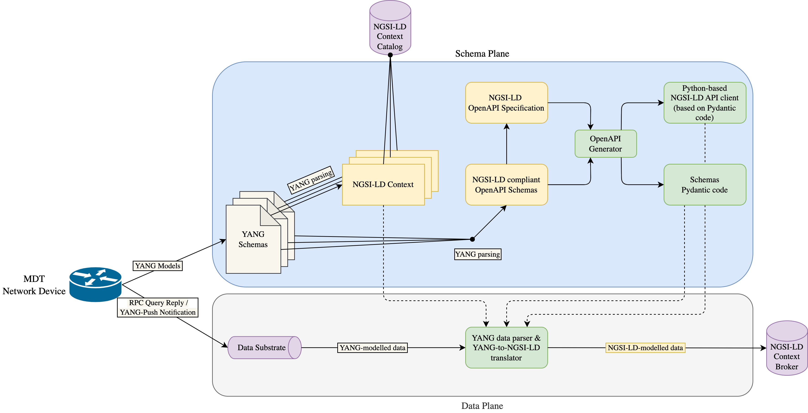

# YANG to NGSI-LD
Repository with source code, artifacts and documentation about YANG to NGSI-LD translation.

## Developed _pyang_ plugins:
- [ngsi-ld-context.py](yang/pyang/ngsi-ld-context.py): generates NGSI-LD context files given one or several YANG modules.
- [xml-parser-generator.py](yang/pyang/xml-parser-generator.py): generates a XML parser given one or several YANG modules.

## Documentation and links
- pyang: https://github.com/mbj4668/pyang
- pyangbind: https://github.com/robshakir/pyangbind
- pydantic: https://docs.pydantic.dev/latest/
- poetry: https://python-poetry.org
- OpenAPI specification for the NGSI-LD API specified by ETSI ISG CIM 009: https://forge.etsi.org/rep/NGSI-LD/NGSI-LD/-/tree/1.6.1
